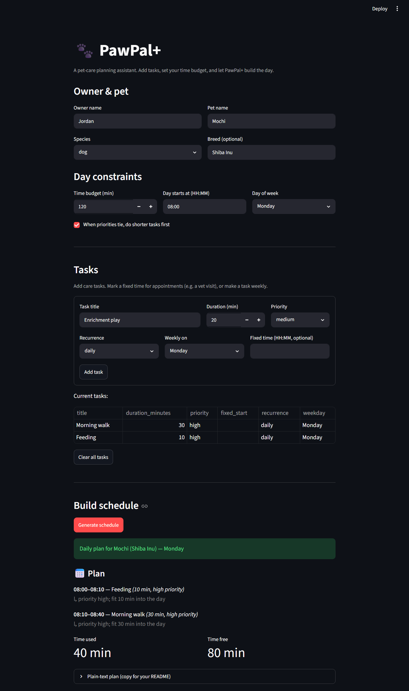

# PawPal+ (Module 2 Project)

You are building **PawPal+**, a Streamlit app that helps a pet owner plan care tasks for their pet.

## Scenario

A busy pet owner needs help staying consistent with pet care. They want an assistant that can:

- Track pet care tasks (walks, feeding, meds, enrichment, grooming, etc.)
- Consider constraints (time available, priority, owner preferences)
- Produce a daily plan and explain why it chose that plan

Your job is to design the system first (UML), then implement the logic in Python, then connect it to the Streamlit UI.

## What you will build

Your final app should:

- Let a user enter basic owner + pet info
- Let a user add/edit tasks (duration + priority at minimum)
- Generate a daily schedule/plan based on constraints and priorities
- Display the plan clearly (and ideally explain the reasoning)
- Include tests for the most important scheduling behaviors

## Getting started

### Setup

```bash
python -m venv .venv
source .venv/bin/activate  # Windows: .venv\Scripts\activate
pip install -r requirements.txt
```

### Suggested workflow

1. Read the scenario carefully and identify requirements and edge cases.
2. Draft a UML diagram (classes, attributes, methods, relationships).
3. Convert UML into Python class stubs (no logic yet).
4. Implement scheduling logic in small increments.
5. Add tests to verify key behaviors.
6. Connect your logic to the Streamlit UI in `app.py`.
7. Refine UML so it matches what you actually built.

## 🖥️ Sample Output

Paste a sample of your app's CLI or Streamlit output here so a reader can see what a generated plan looks like:

Generated with `DailyPlan.render()` (a 120-minute budget starting at 08:00, planned for a Monday):

```
Daily plan for Biscuit (Golden Retriever):
  08:00 — Feeding (10 min) [priority: high]
  08:10 — Morning walk (30 min) [priority: high]
  08:40 — Enrichment play (20 min) [priority: medium]
  10:00 — Vet checkup (45 min) [priority: high]

Skipped:
  - Bath: not scheduled for this day
  - Grooming: ran out of time (15 min left, needs 25)

Used 105 of 120 min (15 min free).
```

Note how the scheduler keeps the high/medium tasks, routes the flexible tasks
around the fixed 10:00 vet appointment, skips the weekly bath (wrong day), and
drops the low-priority grooming once the time budget runs out.

## 🧪 Testing PawPal+

```bash
# Run the full test suite:
pytest

# Run with coverage:
pytest --cov
```

Sample test output:

```
$ pytest -q
.......................                                                  [100%]
23 passed in 0.06s
```

## 📐 Smarter Scheduling

All scheduling lives in `pawpal_system.py` (`Scheduler.build_plan`).

| Feature | Method(s) | Notes |
|---------|-----------|-------|
| Task sorting | `Scheduler.build_plan` (sort keys) | Flexible tasks sorted by priority (high→low), then by duration (shorter first when `Owner.prefer_short_first`), then insertion order for stability. |
| Filtering | `Scheduler.build_plan` (budget check) | A task is skipped when it doesn't fit the owner's remaining `available_minutes`; the reason ("ran out of time…") is recorded on the `DailyPlan.skipped` list. |
| Conflict handling | `ScheduledTask.overlaps`, `Scheduler._next_free_slot` | Fixed appointments are placed first; an overlapping lower-priority appointment is dropped, and flexible tasks are routed into the next free gap so nothing overlaps. |
| Recurring tasks | `Task.occurs_on`, `Recurrence` enum | `daily` tasks are always candidates; `weekly` tasks only appear on their `weekday`. Pass `weekday=` to `build_plan` to filter for a given day. |

## 📸 Demo Walkthrough

Run `streamlit run app.py`, then:

1. **Enter owner & pet info** — type the owner's name and the pet's name, species, and breed (e.g. Jordan / Mochi, a Shiba Inu).
2. **Set the day's constraints** — choose a time budget (e.g. 120 min), a start time (08:00), and the day of week to plan for, then decide whether ties should favor shorter tasks first.
3. **Add tasks** — for each task give a title, duration, and priority. Optionally set a fixed time for appointments (e.g. a 10:00 vet visit) or mark a task as weekly on a specific day.
4. **Click "Generate schedule"** — PawPal+ sorts by priority, places appointments, fills the remaining budget, and shows the timeline with a one-line reason under each task.
5. **Review the results** — see time used vs. free, a "Skipped" list explaining what didn't fit and why, and a plain-text plan you can copy straight into this README.

**Screenshot**:


